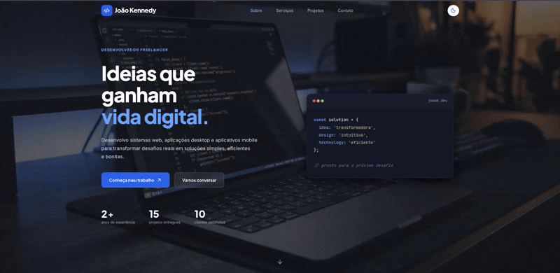

<h1 align="center">Portfólio Front-End Web</h1>

<div align="center">


</div>

Aplicação web estática e responsiva no estilo landing page, desenvolvida como portfólio de apresentação de projetos, serviços e habilidades técnicas. O projeto foi construído integralmente com tecnologias nativas da web (HTML5, CSS3 modular com metodologia BEM e JavaScript Vanilla).

---

## Demonstração Interativa do Projeto

<div align="center">
  
</div>

---

## Funcionalidades Principais

- Cabeçalho Inteligente Flutuante (Smart Sticky Header): Comportamento adaptativo de rolagem que oculta a barra de navegação ao rolar para baixo e a reapresenta suavemente ao rolar para cima.
- Alternância de Tema (Dark/Light Mode): Suporte completo a temas claro e escuro com persistência e detecção automática da preferência do sistema operacional.
- Rastreamento Ativo de Seções (Scroll Spy): Destaque dinâmico e preciso do link correspondente no cabeçalho conforme a rolagem do usuário, incluindo detecção inteligente de final de página para a seção de contato.
- Animações ao Scroll Nativas (Scroll Reveal): Efeito de revelação gradual e escalonamento em cascata.
- Navegação Responsiva: Menu principal otimizado para dispositivos móveis com drawer vertical deslizante e fechamento automático ao selecionar âncoras.
- Tipografia e Espaçamentos: Uso de funções CSS, unidades relativas e dimensionamento adaptativo proporcional entre desktop e mobile.
- Identidade Visual: Composição de layout com cards elevados, molduras com sobreposição calculada e badges de status com indicador visual.

---

## Arquitetura de Software e Padrões Adotados

### 1. CSS Modular e Metodologia BEM (Block, Element, Modifier)
A estilização é estruturada seguindo a convenção BEM:
- Bloco: Representa o componente independente.
- Elemento: Parte constituinte do bloco dependente de seu contexto.
- Modificador: Variação de estado ou aparência.

### 2. Design Tokens com CSS Custom Properties
As variáveis de design estão centralizadas em `css/base/variables.css`, definindo tokens para:
- Cores semânticas para os modos claro e escuro.
- Tokens específicos de estado flutuante, mantendo alto contraste em ambos os temas sem estilos fixos em cascata.
- Escala tipográfica e tamanhos de fonte.
- Espaçamentos universais.
- Dimensionamento de cabeçalho responsivo.
- Raios de borda e elevações por sombras.

### 3. JavaScript Vanilla Orientado a Módulos Isolados
O comportamento dinâmico é particionado em scripts com funções autoexecutáveis:
- `header.js`: Gerenciamento do cabeçalho inteligente (ocultação/exibição na rolagem).
- `theme.js`: Gerenciamento da alternância e persistência de temas.
- `menu.js`: Controle de abertura, acessibilidade e navegação por teclado no menu mobile.
- `smooth-scroll.js`: Rolagem suave programática e Scroll Spy que monitora os alvos da navegação.
- `scroll-reveal.js`: Transições de entrada de elementos no viewport.
- `footer.js`: Injeção dinâmica do ano vigente no rodapé.

---

## Estrutura do Repositório

```text
├── assets/
│   ├── icons/            # Favicon e ícones SVG
│   ├── images/           # Imagens do site
│   └── readme_mideas/    # GIF
├── css/
│   ├── base/
│   │   ├── reset.css     # Normalização e reset de estilos
│   │   ├── typography.css# Configuração de famílias tipográficas e fontes
│   │   └── variables.css # Tokens e variáveis de design
│   ├── components/
│   │   ├── about.css     # Apresentação pessoal e moldura decorativa
│   │   ├── animations.css# Animações de entrada scroll
│   │   ├── buttons.css   # Botões de ação e ícones
│   │   ├── contact.css   # Seção de contato
│   │   ├── footer.css    # Rodapé e links sociais
│   │   ├── header.css    # Barra de navegação
│   │   ├── hero.css      # Seção principal
│   │   ├── portfolio.css # Grade de projetos
│   │   ├── process.css   # Etapas do fluxo de trabalho
│   │   └── services.css  # Cards de serviços
│   └── main.css          # Ponto de entrada que importa os módulos CSS
├── js/
│   ├── footer.js         # Atualização dinâmica de datas
│   ├── header.js         # Controle de rolagem do Smart Sticky Header
│   ├── menu.js           # Gerenciamento do menu responsivo mobile
│   ├── scroll-reveal.js  # Motor de revelação de elementos ao scroll
│   ├── smooth-scroll.js  # Scroll Spy e navegação suave por âncoras
│   └── theme.js          # Sistema de alternância de tema escuro/claro
├── index.html            # Estrutura semântica principal da aplicação
└── README.md             # Documentação técnica do projeto
```

---

## Como Executar o Projeto Localmente

Por se tratar de uma aplicação front-end estática pura, não é necessária a instalação de dependências ou etapas de build/compilação.

### Pré-requisitos
- Navegador web (Google Chrome, Mozilla Firefox, Microsoft Edge ou Safari).
- Git instalado (opcional).

### Passo a Passo

1. Clone o repositório:
```bash
git clone https://github.com/JoaoKSS/Portf-lio_Front-End_WEB.git
```

2. Acesse a pasta do projeto:
```bash
cd Portf-lio_Front-End_WEB
```

3. Execute a aplicação utilizando qualquer uma das abordagens abaixo:

- Opção 1 (Extensão Live Server no VS Code):
  Abra a pasta no Visual Studio Code, clique com o botão direito sobre o arquivo `index.html` e selecione "Open with Live Server".

- Opção 2 (Execução direta):
  Basta dar um duplo clique sobre o arquivo `index.html` para abri-lo diretamente no navegador.

---

## Seções da Aplicação

- Hero: Apresentação inicial com chamada para ação, métricas profissionais de entrega e simulação visual de editor de código.
- Sobre Mim: Resumo de trajetória profissional, atuação acadêmica/institucional e badges de competências técnicas.
- Serviços: Vitrine de soluções em desenvolvimento web, mobile e desktop com estados de foco e hover.
- Portfólio: Apresentação de projetos com cards estruturados, links para repositórios no GitHub e tags de categoria.
- Processo de Trabalho: Metodologia sequencial em 4 etapas (Descoberta, Planejamento, Desenvolvimento e Entrega).
- Contato: Canais diretos de comunicação integrados via e-mail e WhatsApp.
- Rodapé: Identificação autoral, direitos reservados e atalhos para perfis profissionais (GitHub, LinkedIn, Instagram).

---
